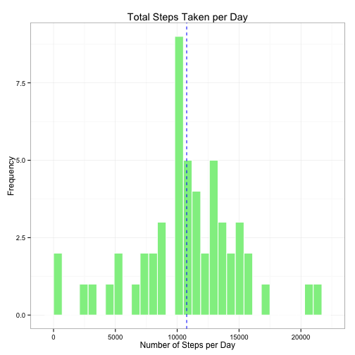
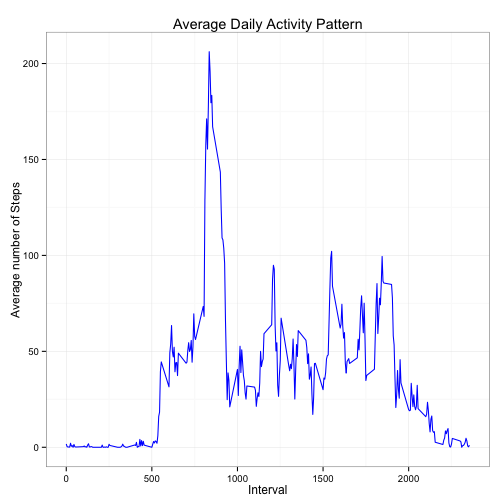
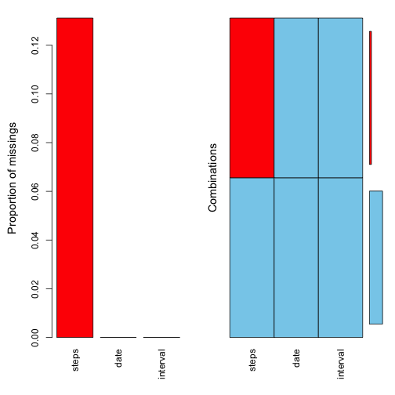
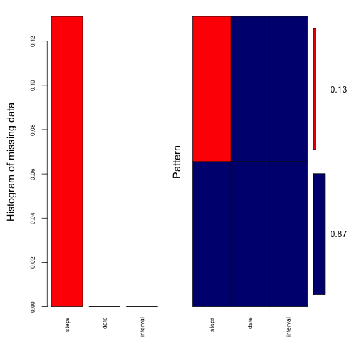
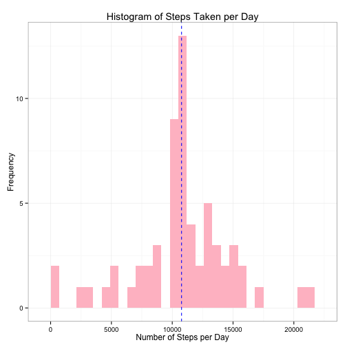

## Introduction

This document shows resluts for the Coursera: Reproducible Research - Peer Assignment 1. The assignment makes use of data from a personal activity monitoring device. The device used collects data at 5 minute intervals through out the day. The data consists of two months of data from an anonymous individual collected during the months of October and November, 2012 and includes the number of steps taken in 5 minute intervals each day. Results are presented in a report using a single R markdown document that can be processed by knitr and be transformed into an HTML file.  

**DATA**  
 *steps* (int): Number of steps taking in a 5-minute interval (missing values are coded as NA)   
 *date* (Date): Date on which the measurement was taken in YYYY-MM-DD format  
 *interval* (int): Identifier for the 5-minute interval in which measurement was taken  

This report answers the following questions:  
 - *What is mean total number of steps taken per day?*  
 - *What is the average daily activity pattern?*  
 - *Are there differences in activity patterns between weekdays and weekends?*  

### Prepare the Environment
#### Load required libraries  
To suppress loading messages set *message = FALSE*. Set global options *echo = TRUE* so others will be able to read the code and set *results = hold* to hold & push output to end of chunk.  


```r
library(knitr)
opts_chunk$set(echo = TRUE, results = 'hold')
library(data.table)
library(ggplot2)
library(plyr)
library(stats) 
library(VIM)
library(mice)
```

**Load and preprocess the data**  

If file not present, download & unpack file

```r
DownURL <- "https://d396qusza40orc.cloudfront.net/repdata%2Fdata%2Factivity.zip"
if(!file.exists("activity.csv")) {
     download.file(DownURL, "Datafile.zip", method = "curl")
     unzip("Datafile.zip")
     unlink("Datafile.zip")
}
```

**Read in the Data**

```r
data <- fread("activity.csv") # 'fread' reads data in quickly
```

**Process/Transform the Data**  
Convert *date* field to a Date class.

```r
data$date <- as.Date(data$date)
```

View the structure of the data using *str()*. Pay special attention to the *class* of the variables.

```r
str(data)
```

```
## Classes 'data.table' and 'data.frame':	17568 obs. of  3 variables:
##  $ steps   : int  NA NA NA NA NA NA NA NA NA NA ...
##  $ date    : Date, format: "2012-10-01" "2012-10-01" ...
##  $ interval: int  0 5 10 15 20 25 30 35 40 45 ...
##  - attr(*, ".internal.selfref")=<externalptr>
```
Notice the data contains NAs.  

## Analysis 1: Average Steps per Day  

First, calculate the total number of steps for each day using *aggregate()*. Set the column names and check the data again using *head()*.

```r
stepsPerDay <- data.table(aggregate(data$steps, by = list(data$date), FUN = sum))
names(stepsPerDay) <- c("date", "steps")
head(stepsPerDay)
```

```
##          date steps
## 1: 2012-10-01    NA
## 2: 2012-10-02   126
## 3: 2012-10-03 11352
## 4: 2012-10-04 12116
## 5: 2012-10-05 13294
## 6: 2012-10-06 15420
```

### What is mean total number of steps taken per day?  

Display the results in a histogram and plot the **mean** for total number of steps taken per day.

```r
ggplot(stepsPerDay, aes(x = steps)) +
     geom_histogram(fill = "light green", color = "white", binwidth = 700) +
     labs(title = "Total Steps Taken per Day", x = "Number of Steps per Day", y = "Frequency") +
     theme_bw() +
     geom_vline(aes(xintercept = mean(steps, na.rm = TRUE)), linetype = "dashed", color = "blue", size = 0.5)
```

 

#### Calculate the **mean** and **median** of the number of steps taken per day.

```r
stepsMean <- mean(stepsPerDay$steps, na.rm = TRUE)
stepsMedian <- median(stepsPerDay$steps, na.rm = TRUE)
```
The mean is **10766.19** and the median is **10765**.  

## Analysis 2: Average Daily Activiy Pattern  
1. Make a time series plot of the of the 5-minute interval (x-axis) and the average number of steps taken, averaged across all days (y-axis)  
2. Calculate which 5-minute interval, on average across all the days in the dataset, contains the maximum number of steps.  

Calculate the average number of steps by intervals (5 min). Set column names and save to a data frame called *stepsInterval*.

```r
stepsInterval <- data.table(aggregate(data$steps, by = list(data$interval), FUN = mean, na.rm = TRUE))
names(stepsInterval) <- c("interval", "meanSteps")
```

### What is the average daily activity pattern?  
Display the results in a time series (line) graph for the average daily activity pattern.

```r
ggplot(stepsInterval, aes(x = interval)) +
     geom_line(color = "blue", aes(y = meanSteps)) +
     labs(title = "Average Daily Activity Pattern", x = "Interval", y = "Average number of Steps") + 
     theme_bw()
```

 

Find the 5 min interval with the maximum number of steps.

```r
max_interval <- stepsInterval[which.max(stepsInterval$meanSteps),]
```

The maiximum steps is **206** located in the **835th**.

## Analysis 3: Imputing Missing Data  

1. Calculate and report the total number of missing values in the dataset.  
2. Devise a strategy for filling in all of the missing values in the dataset.  
3. Create a new dataset that is equal to the original dataset but with the missing data filled in.  
4. Make a histogram of the total number of steps taken each day and Calculate and report the mean and median total number of steps taken per day.
     a. Do these values differ from the estimates from the first part of the assignment?  
     b. What is the impact of imputing missing data on the estimates of the total daily number of steps?  
 
Find the total number of missing values in the data set using *is.na()* method and then *sum()*.

```r
missVals <- sum(is.na(data$steps))
```

The total number of *missing values* in the dataset are **2304**.

#### Examine Data and the missing values a bit further to determine strategy to be used for filling in all of the missing values in the dataset.

Build a subset of the number of Complete Cases - no missing values from the original dataset. Save for later use.

```r
dataCompl <- data[complete.cases(data)]
```

The total number of *Complete Cases* in the dataset are **15264**.  

Look for a pattern of missing values in the original data by using *md.pattern()* funciton from the MICE package.

```r
md.pattern(data)
```

```
##       date interval steps     
## 15264    1        1     1    0
##  2304    1        1     0    1
##          0        0  2304 2304
```

The pattern shows there are **15264** *Complete Cases* and **2304** *Missing Values* for *steps* data. 
Confirm the total number of missing values by using the *aggr()* function from the MICE package.

```r
missingVals <- aggr(data) # this function also produces plots for comparision
```

 

```r
missingVals # confirm the number of missing values
```

```
## 
##  Missings in variables:
##  Variable Count
##     steps  2304
```

Visually examine a pattern to obtain the percentage of missing values using the VIM package. (optional)

```r
aggr_plot <- aggr(data, col=c('navyblue','red'), numbers=TRUE, sortVars=TRUE, labels=names(data), cex.axis=.7, gap=3, ylab=c("Histogram of missing data","Pattern"))
```

 

```
## 
##  Variables sorted by number of missings: 
##  Variable     Count
##     steps 0.1311475
##      date 0.0000000
##  interval 0.0000000
```

Plot shows that **13%** of the steps data are missing in the original dataset.  

#### 2. Strategy for filling in all of the missing values in the dataset.

Substitute the *Missing Values* by taking the **mean** of *steps* from the *dataCompl* dataset. Using the **Mean Imputation** which consists of replacing the *missing value* by the **mean** of the remaing values for the variable in question.  
  
#### 3. Create a new dataset that is equal to the original dataset but with the missing data filled in.

Create a new variable in the main data set by merging it with step mean values And then assign the original value if it is not missing or the replacement value if it is missing.

```r
# Merge original data frame w/ 'stepsInterval' dataframe
compData <- merge(data, stepsInterval, by = "interval", all.y = FALSE)
# Merge NA values w/ averages rounding up for integers
compData$steps[is.na(compData$steps)] <- as.integer(round(compData$meanSteps[is.na(compData$steps)])) 
# Order dataset w/ imputed values by 'date' and then by 'interval'
compData <- compData[order(compData$date, compData$interval)]
compData$meanSteps <- NULL # drop column
head(compData) # check data
```

```
##    interval steps       date
## 1:        0     2 2012-10-01
## 2:        5     0 2012-10-01
## 3:       10     0 2012-10-01
## 4:       15     0 2012-10-01
## 5:       20     0 2012-10-01
## 6:       25     2 2012-10-01
```

#### Make a histogram of the total number of steps taken each day.  

Calculate the total number for steps with the new imputed data. Display results in a time series plot.

```r
newStepsPerDay <- data.table(aggregate(compData$steps, by = list(compData$date),
                                      FUN = sum))
names(newStepsPerDay) <- c("date", "sumSteps")
head(newStepsPerDay)

##plotting the histogram
ggplot(newStepsPerDay, aes(x = sumSteps)) + 
       geom_histogram(fill = "pink", binwidth = 700) + 
        labs(title="Histogram of Steps Taken per Day", x = "Number of Steps per Day", y = "Frequency") + 
     geom_vline(aes(xintercept = mean(sumSteps, na.rm = TRUE)), linetype = "dashed", color = "blue", size = 0.5) +
     theme_bw() 
```

 

```
##          date sumSteps
## 1: 2012-10-01    10762
## 2: 2012-10-02      126
## 3: 2012-10-03    11352
## 4: 2012-10-04    12116
## 5: 2012-10-05    13294
## 6: 2012-10-06    15420
```

#### Calculate and report the **mean** and **median** for the total number of steps taken per day.  

```r
newStepsMean <- mean(newStepsPerDay$sumSteps, na.rm = TRUE)
newStepsMedian <- median(newStepsPerDay$sumSteps, na.rm = TRUE)
```

The *mean* is **10766.189** and the *median* is **10765**.  

#### Do these values differ from the estimates from the first part of the assignment?  
Yes, but the difference is minimal.  
     * Stats before imputation of data:  
          - *Mean*: **10766.19**  
          - *Median*: **10765**  
     * Stats after imputation of data:  
          - *Mean*: 10765.64  
          - *Median*: 10762  

#### What is the impact of imputing missing data on the estimates of the total daily number of steps?  
When comparing the *Before* and *After* **mean** and **median** calculations we observe that the *mean* has a slight increase but very minimal. The *median* also increases producing a slight shift in the **median**. The imputation of the *mean* for the *Missing Values* caused an increase but did not negatively affect the predictions.

## Analysis 4: Activity for Type of Day Weekday vs Weekend

1. Create a new factor variable in the dataset with two levels – “weekday” and “weekend” indicating whether a given date is a weekday or weekend day.
2. Make a panel plot containing a time series plot (i.e. type = "l") of the 5-minute interval (x-axis) and the average number of steps taken, averaged across all weekday days or weekend days (y-axis).

Create a new factor variable “dayType” indicating the two possible levels, weekday or weekend.

```r
compData$day <- as.factor(weekdays(compData$date))
dayType <- function(day) {
     if ((day) %in% c("Saturday", "Sunday")) {
          "weekend"
     } else {
          "weekday"
     }
}
compData$dayType <- as.factor(sapply(compData$day, dayType))
```
#### Are there differences in activity patterns between weekdays and weekends?

Make a panel plot containing a time series plot of the 5-minute interval (x-axis) and the average number of steps taken, averaged across all weekday days or weekend days (y-axis).

```r
library(plyr)

StepsPerDayComplete <- ddply(compData, c("interval", "dayType"), summarise,
                              mean = round(mean(steps)))

ggplot(StepsPerDayComplete, aes(x=interval, y=mean)) + 
     geom_line(aes(group = dayType, colour=dayType)) +
     facet_wrap( ~ dayType, ncol=1) +
     labs(x = "Interval", y = "Number of steps") + 
     theme_bw() +
     theme(legend.position="none")
```

 

## Conclusion  
We can see that the activity increases through the weekdays with a spike that may indicate some sport level activity. One can infer that the increased activity through the weekdays is work related. 
